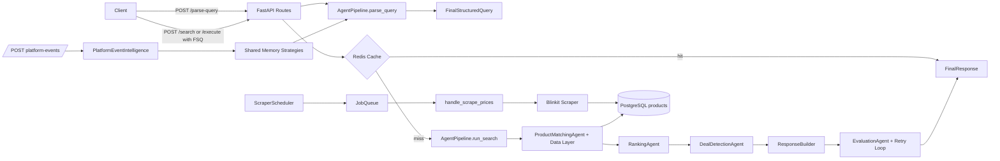
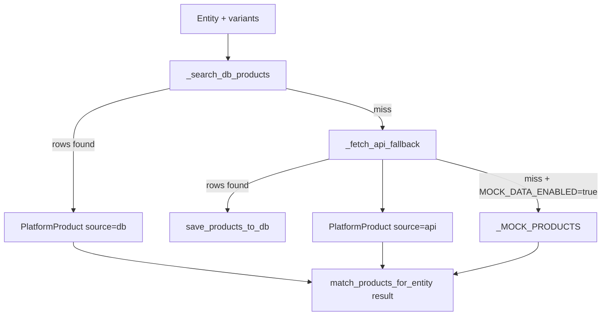
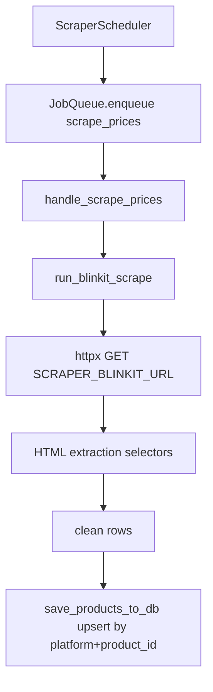

# SmartCart AI Backend

SmartCart AI Backend is a FastAPI service that converts grocery-focused natural language input into a structured execution contract, then executes product matching, ranking, deal detection, recipe planning, and cart optimization across supported platforms.

The implementation is centered around:
- API routes (`app/api/routes/*`)
- Multi-agent orchestrator (`app/orchestrator/pipeline.py`)
- Product data layer (`app/data/layer.py`)
- Response assembly (`app/response/builder.py`)
- Background ingestion (`app/jobs/scheduler.py`, `app/queue/worker.py`, `app/scrapers/blinkit_scraper.py`)
- Event intelligence (`app/events/platform_events.py`)

---

## 1) System architecture



### Runtime composition
- `app/main.py` creates the FastAPI app, includes routers (`search`, `recipe`, `cart`, `events`), mounts `/ui-assets`, and serves `/ui`.
- The lifespan hook initializes DB, cache, queue workers, and scraper scheduler on startup; it stops them on shutdown.
- API routes are mounted at root paths (no `/ai` prefix).

---

## 2) End-to-end execution model

### Two-step search execution contract
Search execution is intentionally split:
1. `POST /parse-query` with `SearchRequest` (`query: str`) returns `FinalStructuredQuery`.
2. `POST /search` (or alias `POST /execute`) accepts `FinalStructuredQuery` and returns `FinalResponse`.

`/search` does **not** accept raw query text.

### Parse phase (`AgentPipeline.parse_query`)
Ordered stages:
1. `LanguageProcessingAgent`
2. `IntentDetectionAgent`
3. `EntityExtractionAgent`
4. `NormalizationAgent.run_entities`
5. `ConstraintExtractionAgent`
6. `DomainGuardAgent`
7. `AmbiguityReasoningAgent`
8. `FallbackAgent`
9. `UserContextAgent`
10. `ExecutionPlannerAgent`
11. `ConstraintOptimizerAgent.derive_weights`
12. `OutputFormatterAgent` -> `FinalStructuredQuery`

Additional operations in this phase:
- stage logging via `QueryLoggingAgent`
- learning signal initialization via `LearningSignals`
- platform signal merge from shared memory
- coordination trace update

### Search phase (`AgentPipeline.run_search`)
High-level behavior:
1. Enforce `domain_guard` and unsupported intent gates.
2. Branch to recipe flow if execution graph includes `recipe_generation`.
3. Build candidate entities from `candidate_paths` + primary normalized entity.
4. For each candidate path: normalize -> match -> rank -> deals -> response -> evaluate.
5. Select best path by max evaluation quality score.
6. Retry loop bounded by `_MAX_REASONING_RETRY_ATTEMPTS = 3`.
7. Apply budget post-filtering and no-result budget message.
8. Attach coordination trace and platform signals in response metadata.
9. Emit user behavior platform event.

### Recipe phase (`AgentPipeline.run_recipe`)
- Delegates to `RecipeAgent.run(query, servings)`.
- `RecipeAgent` obtains ingredient plan from LLM manager with fallback recipe map on failure.
- Ingredients are normalized, matched against product data, and cheapest in-stock options are selected.
- Output is formatted with `ResponseBuilder.build_recipe_response`.

### Cart optimization phase (`AgentPipeline.run_cart_optimize`)
- Normalizes each cart item.
- Retrieves candidates with `get_products_for_entity`.
- Selects global per-item best option by objective:
  `price + (delivery_weight * normalized_delivery * price)`
  with delivery weight = `0.2`.
- Groups selected items by platform and compares against aggregated single-platform totals to compute savings.

---

## 3) Methodologies implemented

## Agentic decomposition with strict contracts
- Parsing and execution are separated by `FinalStructuredQuery`.
- Execution consumes planner artifacts (`execution_plan`, `execution_graph`, `candidate_paths`) instead of reparsing raw text.

## Hybrid intelligence design
- LLM-assisted tasks (normalization, recipe extraction) are guarded with deterministic fallbacks.
- Ranking/constraints/deal logic are deterministic and testable.

## Reliability controls
- Evaluation-driven retry loop (quality/failure signals).
- Optional Redis cache with graceful no-op behavior if unavailable.
- API fallback with bounded retries and exponential backoff for 429/transport failures.
- Startup continues in degraded mode if DB init fails.

## Background ingestion separation
- Scraping is decoupled from request path (scheduler -> queue -> worker -> scraper -> DB).

---

## 4) Data flow

### Product data retrieval path


### Scraper ingestion path


### Event intelligence path
- `POST /platform-events` ingests `PlatformEvent`.
- User behavior updates user model counters/history (`clicks`, `purchases`, `ignored`, `ctr`).
- Order events update purchase history.
- Inventory/price events update `market_signals` strategy.
- Cross-service recommendation/analytics/forecast signals are stored and later merged into parse/search behavior.

---

## 5) API surface

Implemented endpoints:
- `POST /parse-query`
- `POST /search`
- `POST /execute` (alias of `/search`)
- `POST /recipe`
- `POST /cart-optimization`
- `POST /platform-events`
- `GET /health`
- `GET /`
- `GET /ui`
- `GET /ui-assets/*`

For full API technical contract details, see `app/api/README.md`.

---

## 6) Core data contracts

### `FinalStructuredQuery` (execution input)
Contains parse outputs plus control-plane artifacts:
- query understanding: `clean_query`, `intent_result`, `raw_entities`, `normalized_entities`, `constraints`
- control decisions: `domain_guard`, `ambiguity`, `fallback`
- planning: `execution_plan`, `execution_graph`, `candidate_paths`
- personalization/learning: `user_context`, `learning_signals`, `evaluation_history`, `failure_policies`
- runtime overlays: `platform_signals`, `coordination_trace`
- executable payload: `structured_query`

### `FinalResponse` (all endpoint outputs)
Uniform response shape:
- `query`
- `results`
- `best_option`
- `deals`
- `total_price`
- `metadata`

Search result rows include runtime provenance and URL state:
- `source` (`db`, `api`, `mock` depending on path)
- `link_status` (`available` or `link unavailable`)

---

## 7) Security and validation behavior

- API key auth (`verify_api_key`): open access when `API_KEYS` is empty; otherwise rejects invalid/missing key with 401.
- Sliding-window in-memory rate limiter keyed by client IP (`X-Forwarded-For` aware), 429 on exceed.
- Pydantic request validation for bounds and non-whitespace constraints.
- Global exception handlers return structured error payloads for custom and unexpected exceptions.

---

## 8) Configuration

Environment-backed settings are defined in `app/core/config.py`.

Key groups:
- App/security: `DEBUG`, `API_KEY_HEADER`, `API_KEYS`, `RATE_LIMIT_REQUESTS`, `RATE_LIMIT_WINDOW_SECONDS`
- LLM: `LLM_PROVIDER`, `OPENAI_API_KEY`, `GROQ_API_KEY`, model/temperature/token settings
- Cache: `REDIS_URL`, `CACHE_TTL_SECONDS`
- Data/runtime: `DATABASE_URL`, `DB_SCHEMA_AUTO_CREATE`, `DB_ECHO`, `MOCK_DATA_ENABLED`
- Ingestion: `SCRAPER_ENABLED`, `SCRAPER_INTERVAL_MINUTES`, `SCRAPER_BLINKIT_URL`
- API fallback: `API_FALLBACK_ENABLED`, `API_FALLBACK_MAX_RETRIES`, `API_FALLBACK_BACKOFF_SECONDS`, `EXTERNAL_PRODUCT_API_URL`

---

## 9) Local execution

```bash
pip install -r requirements.txt
uvicorn app.main:app --host 0.0.0.0 --port 8000
```

Optional UI:
- Open `http://localhost:8000/ui`

---

## 10) Test execution

```bash
python -m pytest -q
```

The current repository test suite validates API contracts, pipeline behavior, and agent internals.
