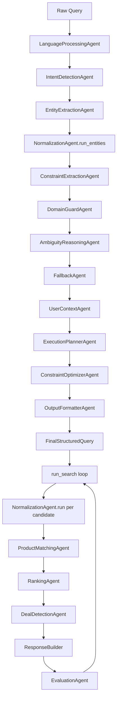

# Agents Layer Technical Documentation

This document describes the implemented agents in `app/agents` and how `AgentPipeline` composes them into parse-time and execution-time flows.

---

## 1) Agent orchestration model

`AgentPipeline` (in `app/orchestrator/pipeline.py`) is the orchestration entrypoint used by API routes.

It has two major phases:
1. **Intelligence construction** (`parse_query`) -> `FinalStructuredQuery`
2. **Execution** (`run_search`) -> `FinalResponse`



Cross-cutting collaborators used by pipeline:
- `QueryLoggingAgent`
- `LearningLoop`
- `SynonymMemoryAgent`
- shared memory + coordination network integrations

---

## 2) Parse phase: internal execution flow

`parse_query(query: str)` executes this strict sequence:
1. `LanguageProcessingAgent.run` -> `CleanQuery`
2. `IntentDetectionAgent.run` -> `IntentResult`
3. `EntityExtractionAgent.run` -> `RawEntities`
4. `NormalizationAgent.run_entities` -> `NormalizedEntities`
5. `ConstraintExtractionAgent.run` -> `Constraints`
6. `DomainGuardAgent.run` -> `DomainGuardResult`
7. `AmbiguityReasoningAgent.run` -> `AmbiguityDecision`
8. `FallbackAgent.run` -> `FallbackDecision`
9. `UserContextAgent.run` -> `UserContext`
10. `ExecutionPlannerAgent.run` -> (`ExecutionPlan`, `ExecutionGraph`, `candidate_paths`)
11. `ConstraintOptimizerAgent.derive_weights` -> ranking preference weights
12. `OutputFormatterAgent.run` -> `FinalStructuredQuery`

Additional parse-time operations:
- Stage-level telemetry via `QueryLoggingAgent.run(stage, payload)`.
- Creation of default `failure_policies`.
- Construction of `learning_signals` (including unresolved entities and ranking adjustments).
- Enrichment from shared-memory recommendation/forecast signals into `platform_signals` and `user_context`.
- Coordination trace capture.

---

## 3) Execution phase: search, evaluation, and retry

`run_search(final_structured: FinalStructuredQuery)`:
1. Applies domain guard and unsupported intent exits.
2. If execution graph includes `recipe_generation`, delegates to recipe pipeline.
3. Loads policy/market signals and merges ranking preferences.
4. Builds and sanitizes candidate entity list.
5. Iterates over candidates per retry cycle:
   - normalize candidate (`NormalizationAgent.run`)
   - match products (`ProductMatchingAgent.run`)
   - apply live market signal stock/price adjustments
   - rank (`RankingAgent.run`)
   - apply budget optimization filter
   - detect deals (`DealDetectionAgent.run`)
   - build candidate response (`ResponseBuilder.build_search_response`)
   - evaluate (`EvaluationAgent.run`)
6. Selects best path by max `quality_score`.
7. Retries while `should_retry` and retries < `_MAX_REASONING_RETRY_ATTEMPTS` (`3`).
8. Updates candidate path selection status + quality.
9. Applies budget hard filter on final response rows.
10. Emits learning outcomes and user behavior platform event.

Retry-trigger signal handling includes:
- `poor_match_quality` -> expand candidates
- `constraint_violation` -> rebalance ranking weights toward cheap preferences

---

## 4) Agent responsibilities and implemented behavior

## LanguageProcessingAgent (`language_processing.py`)
- Normalizes text (`NFKC`), lowercases, tokenizes, removes punctuation/noise.
- Produces `CleanQuery` (`text`, `language`, `tokens`, `normalized_text`).

## IntentDetectionAgent (`intent_detection.py`)
- Heuristic intent classification for search/recipe/cart/exploratory/unsupported.
- Supports secondary intent extraction.

## EntityExtractionAgent (`entity_extraction.py`)
- Extracts primary and candidate entities from normalized query.
- Emits ambiguity flags and candidate entities.

## NormalizationAgent (`normalization.py`)
- LLM-first canonicalization with deterministic fallback maps.
- Integrates synonym memory reinforcement (`SynonymMemoryAgent`).
- Exposes single-item and batch normalization paths.

## ConstraintExtractionAgent (`constraint_extraction.py`)
- Extracts budget/servings/preferences from query text.
- Builds initial ranking preference weights and conflict notes.

## DomainGuardAgent (`domain_guard.py`)
- Blocks unsupported/invalid-domain queries and empty normalized queries.
- Emits `DomainGuardResult` gate used in execution.

## AmbiguityReasoningAgent (`ambiguity_reasoning.py`)
- Detects whether resolution is needed based on confidence, flags, candidate count, and intent type.
- Skips ambiguity for single clear high-confidence entities.

## FallbackAgent (`fallback.py`)
- Chooses fallback mode and alternatives for exploratory or unresolved-entity scenarios.

## UserContextAgent (`user_context.py`)
- Reads/updates user profile data in shared memory.
- Derives preferences/dietary/budget/consumption behavior and predicted needs.

## ExecutionPlannerAgent (`execution_planner.py`)
- Constructs operation plan and execution graph.
- Adds recipe/cart nodes based on primary and secondary intents.
- Generates candidate execution paths with confidence ordering.

## ConstraintOptimizerAgent (`constraint_optimizer.py`)
- Derives normalized ranking weights from query and user preference signals.
- Provides candidate scoring used in budget optimization.

## ProductMatchingAgent (`product_matching.py`)
- Calls data layer `match_products_for_entity`.
- Applies filters (`max_price`, `min_price`, `brand`) and top-k relaxation when strict filters empty the set.

## RankingAgent (`ranking.py`)
- Computes weighted composite score (price/delivery/rating/discount).
- Supports deterministic price-first ordering when price preference is dominant.

## DealDetectionAgent (`deal_detection.py`)
- Detects standard/trending deals based on discount thresholds.

## EvaluationAgent (`evaluation.py`)
- Scores response quality and emits failure signals/corrections.
- Controls retry via `should_retry`.

## OutputFormatterAgent (`output_formatter.py`)
- Deterministically assembles all stage outputs into `FinalStructuredQuery`.

## QueryLoggingAgent (`query_logging.py`)
- Captures per-stage pipeline payloads for observability.

## RecipeAgent (`recipe.py`)
- LLM ingredient generation with fallback recipe mapping.
- Ingredient normalization + matching + cheapest option selection.

## SynonymMemoryAgent (`synonym_memory.py`)
- Persists and recalls synonym/canonical mappings used by normalization and learning loop.

---

## 5) Execution-path branching and selection

`FinalStructuredQuery.candidate_paths` and runtime candidate entities drive multi-path reasoning.

Path lifecycle:
1. Initialize candidate list from planner + primary normalized entity.
2. Evaluate each candidate path in current retry iteration.
3. Record `EvaluationFrame` in `evaluation_history`.
4. Choose best-quality path.
5. Mark selected path (`selected=True`, `status="selected"`) and non-selected as `evaluated`.

This enables controlled ambiguity handling without reparsing the raw query.

---

## 6) Data contracts owned/used by agent layer

Core models are defined in `app/data/models.py`.

Key parse-time models:
- `CleanQuery`, `IntentResult`, `RawEntities`, `NormalizedEntities`, `Constraints`
- `DomainGuardResult`, `AmbiguityDecision`, `FallbackDecision`
- `ExecutionPlan`, `ExecutionGraph`, `CandidateExecutionPath`
- `UserContext`, `LearningSignals`, `EvaluationFrame`, `FailurePolicy`
- `FinalStructuredQuery`

Execution-time models:
- `StructuredQuery`, `UnifiedProduct`, `RankingResult`, `DealResult`, `FinalResponse`

---

## 7) Recipe and cart methodology reuse

Normalization is reused outside parse/search:
- Recipe ingredient mapping normalizes each ingredient prior to product lookup.
- Cart optimization normalizes each cart item before platform comparison.

This keeps entity resolution behavior consistent across workflows.

---

## 8) Testing and validation

Agent-focused tests:
```bash
python -m pytest -q tests/test_agents.py tests/test_pipeline.py
```

These tests cover:
- parse-query contract completeness
- ranking/deal behavior
- ambiguity handling
- retry loop behavior
- normalization synonym mapping
- recipe/cart pipeline outputs
