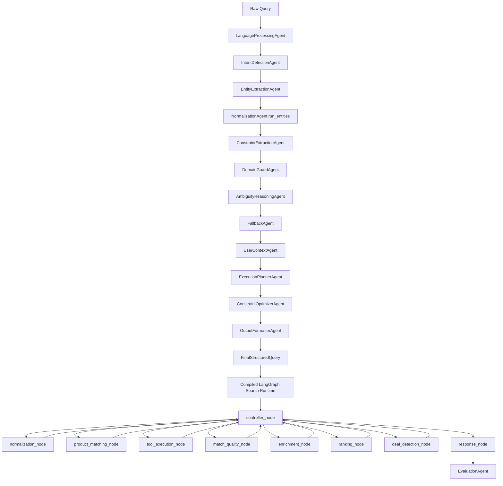

# Agents Layer Technical Documentation

This document describes the implemented agents in `app/agents` and how `AgentPipeline` composes them into parse-time and execution-time flows.

---

## 1) Agent orchestration model

`AgentPipeline` (in `app/orchestrator/pipeline.py`) is the orchestration entrypoint used by API routes.

It has two major phases:
1. **Intelligence construction** (`parse_query`) -> `FinalStructuredQuery`
2. **Execution** (`run_search`) -> `FinalResponse`



Cross-cutting collaborators used by pipeline:
- `QueryLoggingAgent`
- `LearningLoop`
- `SynonymMemoryAgent`
- shared memory + coordination network integrations

---

## 2) Parse phase: internal execution flow

`parse_query(query: str)` executes this strict sequence:
1. `LanguageProcessingAgent.run` -> `CleanQuery`
2. `IntentDetectionAgent.run` -> `IntentResult`
3. `EntityExtractionAgent.run` -> `RawEntities`
4. `NormalizationAgent.run_entities` -> `NormalizedEntities`
5. `ConstraintExtractionAgent.run` -> `Constraints`
6. `DomainGuardAgent.run` -> `DomainGuardResult`
7. `AmbiguityReasoningAgent.run` -> `AmbiguityDecision`
8. `FallbackAgent.run` -> `FallbackDecision`
9. `UserContextAgent.run` -> `UserContext`
10. `ExecutionPlannerAgent.run` -> (`ExecutionPlan`, `ExecutionGraph`, `candidate_paths`)
11. `ConstraintOptimizerAgent.derive_weights` -> ranking preference weights
12. `OutputFormatterAgent.run` -> `FinalStructuredQuery`

Additional parse-time operations:
- Stage-level telemetry via `QueryLoggingAgent.run(stage, payload)`.
- Creation of default `failure_policies`.
- Construction of `learning_signals` (including unresolved entities and ranking adjustments).
- Enrichment from shared-memory recommendation/forecast signals into `platform_signals` and `user_context`.
- Coordination trace capture.

---

## 3) Execution phase: controller-driven search graph, evaluation, and retry

`run_search(final_structured: FinalStructuredQuery)`:
1. Applies domain guard and unsupported intent exits.
2. If execution graph includes `recipe_generation`, delegates to recipe pipeline.
3. Loads policy/market signals and merges ranking preferences.
4. Seeds `SearchGraphState` with:
   - `user_query`
   - `structured_query`
   - `final_structured_query`
   - `current_step`
   - `next_action`
   - `last_observation`
   - `candidate_entities`
   - `ranking_preferences`
   - `market_signals`
   - `retry_count`
   - `decision_trace`
   - `tool_trace`
   - `tool_request`
   - `tool_result`
5. Invokes the compiled LangGraph runtime:
   - `controller_node` -> controller agent decides the next action from accumulated state
   - `normalization_node` -> `NormalizationAgent.act`
   - `product_matching_node` -> `ProductMatchingAgent.act`
   - `tool_execution_node` -> executes tool requests emitted by `ProductMatchingAgent`
   - `match_quality_node` -> classifies `strong | weak | empty`
   - `enrichment_node` -> expands variants, ambiguity candidates, and category substitutes
   - `ranking_node` -> `RankingAgent.act` + budget optimization
   - `deal_detection_node` -> `DealDetectionAgent.act`
   - `response_node` -> `ResponseBuilder.build_search_response` + `EvaluationAgent.act`
6. Uses a controller loop instead of fixed conditional edges:
   - controller reads `match_quality`, `tool_request`, `tool_result`, `retry_count`, and `last_observation`
   - controller chooses the next node dynamically
   - every action node returns control to the controller until termination
7. Caps retries at `_MAX_ENRICHMENT_RETRY_ATTEMPTS` (`2`) and records the value in both graph state and `learning_signals.retry_count`.
8. Updates candidate path selection metadata, response observability, learning outcomes, and user behavior platform event.

---

## 4) Base execution agent abstraction

`app/agents/base_execution.py` defines the runtime interface used by controller-driven execution.

Contract:
- read the current graph state
- return only updated keys
- optionally emit `next_action`
- optionally emit `tool_request`
- preserve observability through `last_observation`

This allows legacy deterministic agents to participate in an agent-style runtime without changing route contracts.

---

## 5) Agent responsibilities and implemented behavior

## LanguageProcessingAgent (`language_processing.py`)
- Normalizes text (`NFKC`), lowercases, tokenizes, removes punctuation/noise.
- Produces `CleanQuery` (`text`, `language`, `tokens`, `normalized_text`).

## IntentDetectionAgent (`intent_detection.py`)
- Heuristic intent classification for search/recipe/cart/exploratory/unsupported.
- Supports secondary intent extraction.

## EntityExtractionAgent (`entity_extraction.py`)
- Extracts primary and candidate entities from normalized query.
- Emits ambiguity flags and candidate entities.

## NormalizationAgent (`normalization.py`)
- LLM-first canonicalization with deterministic fallback maps.
- Integrates synonym memory reinforcement (`SynonymMemoryAgent`).
- Exposes single-item and batch normalization paths.
- Exposes `act(state)` for controller-driven runtime normalization.

## ControllerAgent (`controller.py`)
- Reads runtime state and selects the next graph node.
- Uses `tool_request`, `tool_result`, `match_quality`, retry limits, and deal-plan metadata to decide whether to normalize, match, enrich, rank, detect deals, or respond.
- Appends `decision_trace` for graph observability.

## ConstraintExtractionAgent (`constraint_extraction.py`)
- Extracts budget/servings/preferences from query text.
- Builds initial ranking preference weights and conflict notes.

## DomainGuardAgent (`domain_guard.py`)
- Blocks unsupported/invalid-domain queries and empty normalized queries.
- Emits `DomainGuardResult` gate used in execution.

## AmbiguityReasoningAgent (`ambiguity_reasoning.py`)
- Detects whether resolution is needed based on confidence, flags, candidate count, and intent type.
- Skips ambiguity for single clear high-confidence entities.

## FallbackAgent (`fallback.py`)
- Chooses fallback mode and alternatives for exploratory or unresolved-entity scenarios.

## UserContextAgent (`user_context.py`)
- Reads/updates user profile data in shared memory.
- Derives preferences/dietary/budget/consumption behavior and predicted needs.

## ExecutionPlannerAgent (`execution_planner.py`)
- Constructs operation plan and execution graph metadata that mirrors the LangGraph runtime node names and retry edges.
- Adds recipe/cart nodes based on primary and secondary intents.
- Generates candidate execution paths with confidence ordering.

## ConstraintOptimizerAgent (`constraint_optimizer.py`)
- Derives normalized ranking weights from query and user preference signals.
- Provides candidate scoring used in budget optimization.

## ProductMatchingAgent (`product_matching.py`)
- Executes DB-first product matching plus async tool registry fan-out.
- Normalizes tool outputs into `PlatformProduct`, aggregates them into `UnifiedProduct`, and records `MatchingDiagnostics`.
- Applies filters (`max_price`, `min_price`, `brand`) and top-k relaxation when strict filters empty the set.
- Exposes `act(state)` to request tool execution through graph state instead of calling the tool registry inline during controller-driven execution.
- Exposes `execute_tool_request(...)` so the dedicated tool node can run fetch/approximation steps without moving tool ownership out of the agent.

## RankingAgent (`ranking.py`)
- Computes weighted composite score (price/delivery/rating/discount).
- Supports deterministic price-first ordering when price preference is dominant.
- Exposes `act(state)` for graph execution.

## DealDetectionAgent (`deal_detection.py`)
- Detects standard/trending deals based on discount thresholds.
- Exposes `act(state)` for graph execution.

## EvaluationAgent (`evaluation.py`)
- Scores response quality and emits failure signals/corrections.
- Remains responsible for observability and learning feedback after graph execution rather than controlling the search loop directly.
- Exposes `act(state)` so response execution can stay state-driven.

## OutputFormatterAgent (`output_formatter.py`)
- Deterministically assembles all stage outputs into `FinalStructuredQuery`.

## QueryLoggingAgent (`query_logging.py`)
- Captures per-stage pipeline payloads for observability.

## RecipeAgent (`recipe.py`)
- LLM ingredient generation with fallback recipe mapping.
- Ingredient normalization + matching + cheapest option selection.

## SynonymMemoryAgent (`synonym_memory.py`)
- Persists and recalls synonym/canonical mappings used by normalization and learning loop.

---

## 6) Tool usage architecture

Tool execution remains owned by `ProductMatchingAgent` and `app/agents/tools/product_intelligence.py`.

Runtime pattern:
1. `ProductMatchingAgent.act` inspects DB results and emits `tool_request` when enrichment is needed.
2. `tool_execution_node` executes the requested tool batch or approximation request asynchronously.
3. Controller routes back to `product_matching_node`.
4. `ProductMatchingAgent.act` consumes `tool_result` and finalizes `UnifiedProduct`.

This preserves the existing tool stack while making tool usage graph-visible.

---

## 7) Execution-path branching and selection

`FinalStructuredQuery.candidate_paths` and runtime candidate entities drive graph-based path reasoning.

Path lifecycle:
1. Initialize candidate list from planner + primary normalized entity.
2. Normalize and match the active path selected by graph state.
3. Route through `match_quality_node` and optional `enrichment_node`.
4. Record `EvaluationFrame` in `evaluation_history` for the selected path.
5. Mark selected path (`selected=True`, `status="selected"`) and processed non-selected paths as `evaluated`.

This enables controlled ambiguity handling without reparsing the raw query.

---

## 8) Data contracts owned/used by agent layer

Core models are defined in `app/data/models.py`.

Key parse-time models:
- `CleanQuery`, `IntentResult`, `RawEntities`, `NormalizedEntities`, `Constraints`
- `DomainGuardResult`, `AmbiguityDecision`, `FallbackDecision`
- `ExecutionPlan`, `ExecutionGraph`, `CandidateExecutionPath`
- `UserContext`, `LearningSignals`, `EvaluationFrame`, `FailurePolicy`
- `FinalStructuredQuery`

Execution-time models:
- `StructuredQuery`, `UnifiedProduct`, `RankingResult`, `DealResult`, `FinalResponse`

---

## 9) Runtime observability

The controller-driven graph records:
- `decision_trace`
- `tool_trace`
- `fallback_trace`
- `retry_count`
- `match_quality`
- `path_history`

These fields are preserved into final response metadata for debugging and evaluation.

---

## 10) Recipe and cart methodology reuse

Normalization is reused outside parse/search:
- Recipe ingredient mapping normalizes each ingredient prior to product lookup.
- Cart optimization normalizes each cart item before platform comparison.

This keeps entity resolution behavior consistent across workflows.

---

## 11) Testing and validation

Agent-focused tests:
```bash
python -m pytest -q tests/test_agents.py tests/test_pipeline.py
```

These tests cover:
- parse-query contract completeness
- ranking/deal behavior
- ambiguity handling
- controller-driven LangGraph routing behavior
- normalization synonym mapping
- recipe/cart pipeline outputs
