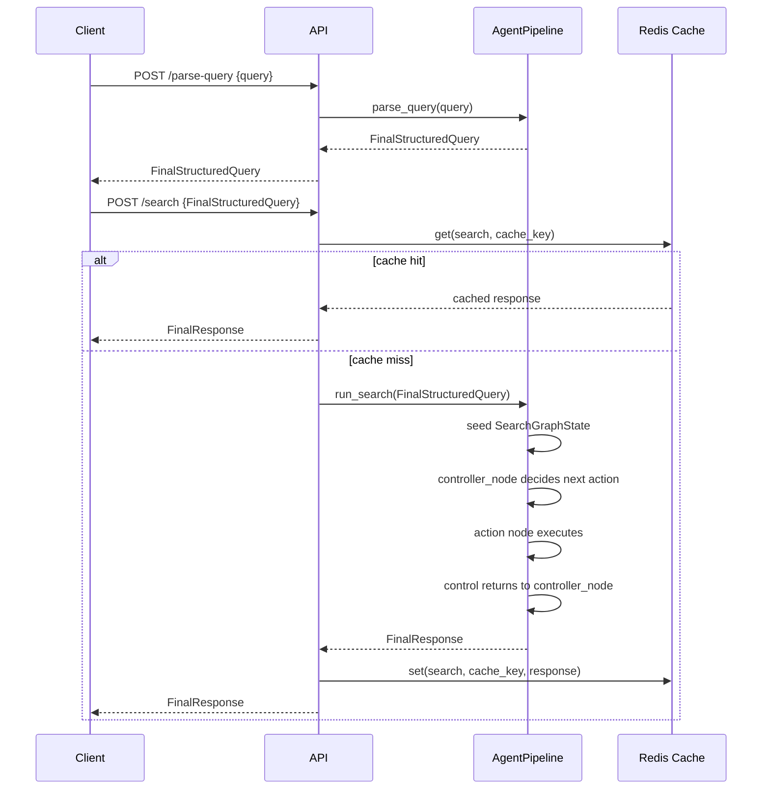

# API Layer Technical Documentation

This document describes the implemented API layer in `app/api`, including route contracts, validation/security rules, cache behavior, and execution flow.

---

## 1) API architecture

`app/main.py` mounts routers from:
- `app/api/routes/search.py`
- `app/api/routes/recipe.py`
- `app/api/routes/cart.py`
- `app/api/routes/events.py`

All routes are mounted at root-level paths.

```mermaid
flowchart LR
    Client --> Route[FastAPI Route Handler]
    Route --> Auth[verify_api_key]
    Auth --> Rate[check_rate_limit]
    Rate --> Validation[Pydantic request validation]
    Validation --> Pipeline[AgentPipeline entrypoint]
    Pipeline --> Graph[Compiled LangGraph Search Runtime]
    Graph --> Controller[controller_node]
    Controller --> Builder[ResponseBuilder]
    Builder --> Response[FinalResponse or dict]
```



---

## 2) Endpoint inventory

### Search routes (`app/api/routes/search.py`)
- `POST /parse-query` -> `FinalStructuredQuery`
- `POST /search` -> `FinalResponse`
- `POST /execute` -> `FinalResponse` (alias to `/search` behavior)

### Recipe route (`app/api/routes/recipe.py`)
- `POST /recipe` -> `FinalResponse`

### Cart route (`app/api/routes/cart.py`)
- `POST /cart-optimization` -> `FinalResponse`

### Events route (`app/api/routes/events.py`)
- `POST /platform-events` -> `dict`

### System/UI routes (`app/main.py`)
- `GET /health`
- `GET /`
- `GET /ui`
- `GET /ui-assets/*`

---

## 3) Contracts and execution per endpoint

## `POST /parse-query`
Handler: `parse_query(body: SearchRequest, request: Request, _api_key=Depends(verify_api_key))`

### Request model: `SearchRequest`
- `query: str` (min 1, max 500)
- whitespace-only queries rejected by validator

### Response model
- `FinalStructuredQuery`

### Execution
1. API key verification
2. Rate limit check
3. `pipeline.parse_query(body.query)`
4. Return strict structured contract

---

## `POST /search`
Handler: `search(body: FinalStructuredQuery, request: Request, _api_key=Depends(verify_api_key))`

### Request model
- `FinalStructuredQuery` only

### Response model
- `FinalResponse`

### Execution
1. API key verification
2. Rate limit check
3. Cache key = `body.structured_query.normalized_query` or `body.clean_query.normalized_text`
4. Cache lookup (`prefix="search"`)
5. On hit: return cached `FinalResponse`
6. On miss: `pipeline.run_search(body)`
7. `run_search` seeds graph state and enters the controller-driven LangGraph runtime
7. Cache write and return

> `/search` does not accept raw natural language text.

---

## `POST /execute`
Handler: `execute(...)`

- Same request/response models as `/search`
- Internally delegates directly to `search(...)`

---

## `POST /recipe`
Handler: `recipe(body: RecipeRequest, request: Request, _api_key=Depends(verify_api_key))`

### Request model: `RecipeRequest`
- `query: str` (trimmed, non-empty)
- `servings: int` (`1..20`, default `2`)

### Response model
- `FinalResponse`

### Execution
1. API key verification
2. Rate limit check
3. Cache key = `"{query}|servings={servings}"`
4. Cache lookup (`prefix="recipe"`)
5. On miss run `pipeline.run_recipe(...)`
6. Cache write and return

---

## `POST /cart-optimization`
Handler: `cart_optimize(body: CartOptimizeRequest, request: Request, _api_key=Depends(verify_api_key))`

### Request model: `CartOptimizeRequest`
- `items: List[CartItem]` (min length 1)
- validator trims names and deduplicates by lowercase normalized name

### Response model
- `FinalResponse`

### Execution
1. API key verification
2. Rate limit check
3. `pipeline.run_cart_optimize(body.items)`
4. Return optimization response

---

## `POST /platform-events`
Handler: `ingest_platform_event(body: PlatformEvent, request: Request, _api_key=Depends(verify_api_key))`

### Request model: `PlatformEvent`
- `event_type: PlatformEventType`
- `user_id: str = "anonymous"`
- `payload: dict`
- `timestamp: str`
- `source: str = "api"`

### Response
- plain dictionary returned by `PlatformEventIntelligence.ingest`

### Execution
1. API key verification
2. Rate limit check
3. `get_platform_event_intelligence().ingest(body)`

---

## 4) Search API execution flow (strict contract)



### Controller-driven search runtime
The API contract is unchanged, but `/search` is now backed by an agent-driven LangGraph runtime.

Controller responsibilities:
- choose the next execution step dynamically
- react to `match_quality`, `tool_request`, `tool_result`, and `retry_count`
- terminate safely when results are strong, retries are exhausted, or no useful candidates remain

Action nodes used by the runtime:
- `parse_query_node`
- `normalization_node`
- `product_matching_node`
- `tool_execution_node`
- `match_quality_node`
- `enrichment_node`
- `ranking_node`
- `deal_detection_node`
- `response_node`

---

## 5) Response structure and field behavior

Search responses are assembled by `ResponseBuilder.build_search_response`.

`POST /search` now executes a compiled LangGraph search runtime behind `AgentPipeline.run_search` while preserving the same route contract and cache behavior.

Each product row includes:
- identity/context: `platform`, `product_id`, `name`, `brand`, `unit`
- pricing: `price`, `original_price`, `discount_percent`
- quality/logistics: `rating`, `delivery_time_minutes`, `in_stock`
- linking/provenance: `url`, `link_status`, `source`
- ranking: `score`, `rank`

`link_status` is derived as:
- `available` when `url` is truthy
- `link unavailable` otherwise

`best_option` mirrors key fields from top-ranked item.

Search response metadata includes:
- `matching` -> `matched_via`, `fallback_trace`, `tool_attempts`, `approximate_match`, `quality_score`, `source_breakdown`
- `search_graph` -> `match_quality`, `retry_count`, `selected_path`, `tool_trace`, `path_history`, `decision_trace`
- `platform_signals` and `coordination_trace` -> orchestration overlays preserved from parse/execution

### Tool usage observability
When the controller routes through `tool_execution_node`, the final response still preserves:
- tool attempts from product intelligence integrations
- fallback/enrichment traces
- controller decision history

This allows API consumers and operators to inspect why a search flowed through enrichment, approximation, or direct ranking.

---

## 6) Security, validation, and error handling

## API key logic (`app/core/security.py`)
- If `API_KEYS` is empty: open access mode.
- If configured: missing/invalid key -> HTTP 401.
- Header name from `API_KEY_HEADER` (default `X-API-Key`).

## Rate limit logic
- In-memory sliding window keyed by client IP.
- IP extraction precedence: `X-Forwarded-For` first, then `request.client.host`.
- Limit/window from settings (`RATE_LIMIT_REQUESTS`, `RATE_LIMIT_WINDOW_SECONDS`).
- Exceed -> HTTP 429.

## Request validation
- Pydantic models enforce required fields and value bounds.
- Validators reject empty/whitespace-only query values.

## Error handlers
Registered globally in `app/core/exceptions.py`:
- `SmartCartException` -> structured custom status response
- generic `Exception` -> structured 500 response

---

## 7) Cache integration behavior

Cache implementation: `app/cache/redis_cache.py`.

- On startup, API attempts Redis connect.
- If unavailable, cache is disabled and calls become no-op (service remains functional).
- Key format: `smartcart:{prefix}:{sha256(query)[:16]}`.
- `/health` exposes cache state as `connected` or `unavailable`.

---

## 8) Operational lifecycle coupling

Startup (lifespan):
1. DB init (degraded-mode continuation on failure)
2. Cache connect
3. Job queue start (2 workers)
4. Scraper scheduler start

Shutdown:
1. Scraper scheduler stop
2. Job queue stop
3. Cache disconnect
4. DB close

---

## 9) Verification

Targeted API tests:
```bash
python -m pytest -q tests/test_api.py
```

Repository-wide tests:
```bash
python -m pytest -q
```
